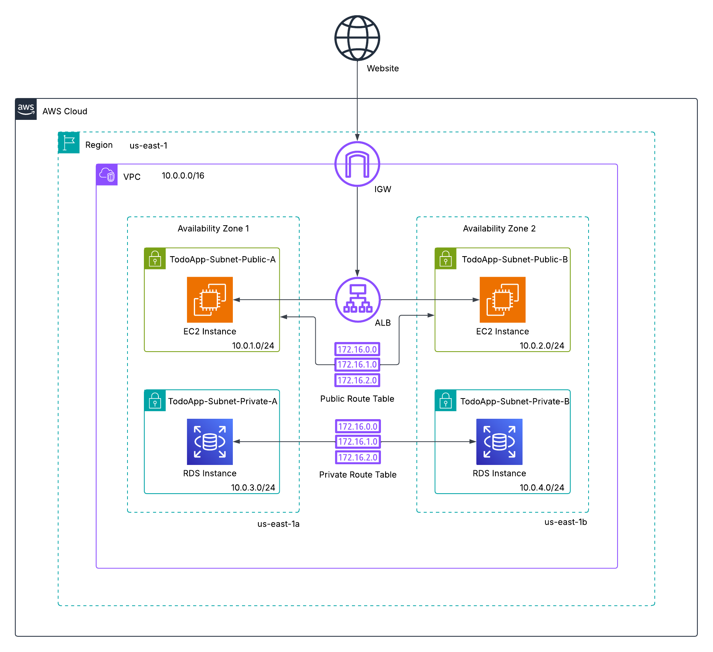

# To-Do List Two-Tier Website
A cloud-native web application that demonstrates a two-tier architecture on AWS. The project provisions a scalable Application Load Balancer (ALB) fronting two EC2 web servers in public subnets, with data persisted in a Multi-AZ RDS MySQL database in private subnets. All infrastructure is automated with nested CloudFormation stacks, following Infrastructure-as-Code best practices.

A Bastion Host is deployed temporarily to initialize the database schema using MySQL client. Once the schema is created, the Bastion Host can be safely terminated.

## Architecture Overview
  
*Figure 1: Architecture diagram of the To-Do Two-Tier Application.*

- **Amazon VPC** – Custom networking with public/private subnets, route tables, and Internet Gateway.
- **Amazon EC2** – Web servers hosting the Node.js application, deployed in public subnets.
- **Application Load Balancer (ALB)** – Distributing HTTP traffic across EC2 web servers.
- **Amazon RDS (MySQL Multi-AZ)** – Highly available relational database for persistent task storage.
- **Amazon S3** – Storing nested CloudFormation templates and application artifacts.
- **Security Groups** – Enforcing least-privilege traffic rules between ALB, web servers, database, and Bastion Host.
- **IAM Roles/Policies** – Instance profiles granting EC2 least-privilege access to S3 artifacts.

## Skills Applied
- Designing and deploying a **two-tier web application architecture** in AWS.
- Building **nested CloudFormation templates** for modular and reusable infrastructure deployments.
- Automating **VPC networking and routing** with subnets and route tables.
- Configuring **load balancing and health checks** with an Application Load Balancer.
- Securing connectivity with **granular security groups** and restricted SSH access.
- Provisioning a **Multi-AZ RDS MySQL database** and automating schema creation via Bastion Host.
- Managing **S3 bucket policies** to enable CloudFormation nested stack access.
- Implementing **PM2 process manager** for Node.js application reliability and auto-restart.

## Features
- **Task Management** – Add, view, complete, and delete to-do items through a simple web UI.
- **Persistent Storage** – Tasks stored in an RDS MySQL backend survive server restarts.
- **Scalable Web Tier** – ALB distributes traffic evenly across multiple EC2 instances.
- **Automated Deployment** – Entire environment provisioned via nested CloudFormation stacks.
- **Secure Database Access** – Database accessible only from web server SGs (not the public internet).
- **Bastion Host Initialization** – One-time DB schema creation without exposing MySQL publicly.

## Tech Stack
- **Languages:** Node.js (JavaScript) 18.20
- **AWS Services:** VPC, EC2, ALB, RDS (MySQL), S3, IAM, Security Groups
- **IaC Tool:** AWS CloudFormation (nested stacks)
- **Other Tools:** PM2, MySQL Client, AWS CLI

## Deployment Instructions
> **Note:** All command-line examples use `bash` syntax highlighting to maximize compatibility and readability. 

> If you are using PowerShell or Command Prompt on Windows, the commands remain the same but prompt styles may differ.

### CloudFormation
1. Clone this repository.

2. Deploy the `s3bucket.yaml` file to create an S3 bucket where the nested CloudFormation templates will be stored. Edit the parameter overrides to customize the deployment:
	```bash
	cd cloudformation
	aws cloudformation deploy \
	--stack-name todoapp-cfn-artifacts \
	--template-file s3-bucket.yaml \
	--parameter-overrides BucketName=<YOUR_BUCKET_NAME> AccountId=<YOUR_ACCOUNT_ID>
	```

3. Upload the nested CloudFormation templates to the S3 bucket:
	```bash
	aws s3 cp phase1-networking.yaml s3://<YOUR_BUCKET_NAME>/cfn/
	aws s3 cp phase2-security.yaml s3://<YOUR_BUCKET_NAME>/cfn/
	aws s3 cp phase3-rds.yaml s3://<YOUR_BUCKET_NAME>/cfn/
	aws s3 cp phase4-ec2.yaml s3://<YOUR_BUCKET_NAME>/cfn/
	```

4. Upload the `Todo-Two-Tier.zip` folder to the S3 bucket:
	```bash
	aws s3 cp Todo-Two-Tier.zip s3://<YOUR_BUCKET_NAME>
	```

5. Edit the `params.json` and `parent-template.yaml` file to customize the deployment.
   - `KeyName` is the SSH key pair that will be used to SSH to the web servers for any additional configuration or troubleshooting. This can be created separately in the AWS Management Console under EC2 > Key Pairs.  
   - `AdminIp` is your public IP address. This is used to lockdown SSH access to the web servers and Bastion Host, allowing only traffic from your IP address.  
   - `DBUser` and `DBPassword` are the credentials that will be used to access the RDS instance. These values are included in the parameter file for convenience. In a production environment, these credentials should be stored and referenced from AWS Secrets Manager.  
   - `S3Bucket` is the name of the S3 bucket created in the previous steps.  
   - `S3Key` is the name of the application folder uploaded to the S3 bucket. This value should not change.  
   - `Phase*TemplateURL` is the Object URL of each nested template (e.g., https://<YOUR_BUCKET_NAME>.s3.<YOUR_REGION>.amazonaws.com/cfn/phase1-networking.yaml).  
   - The default values for `VPCCidr`, `PublicSubnetACidr`, `PrivateSubnetACidr`, `PublicSubnetBCidr`, and `PrivateSubnetBCidr` can be edited in the `parent-template.yaml` file.  

6. Deploy the CloudFormation stack:
	```bash
	aws cloudformation deploy \
	--stack-name todoapp-parent \
	--template-file parent-template.yaml \
	--parameter-overrides file://params.json \
	--capabilities CAPABILITY_NAMED_IAM
	```

**Note:** Ensure the AWS CLI is configured (`aws configure`) with credentials that have sufficient permissions to manage **S3**, **EC2**, **RDS**, **VPCs**, **Subnets**, **Route Tables**, **Security Groups**, and **IAM resources**.

## How to Use
1. **Deploy the infrastructure** using CloudFormation.

2. **Access the application** in a web browser by going to http://<YOUR_ALBDNSName>.

3. **Enter a task name and date (MM/DD/YYYY)**. The Calendar icon can be used to select the date.

4. **Click Add Task** to add the task to the To-Do List. The tasks will show underneath the **Add Task** button. The tasks are persistent when accessing the application in the future.

5. **Select the blue checkmark icon** to complete the task. This will turn the task item green and add a strikethrough to it.

6. **Select the red trashcan icon** to delete a task from the list.

## Project Structure
```plaintext
aws-to-do-list-two-tier-website
├── assets/                          	  # Images, diagrams, screenshots
│   ├── architecture-diagram.png          # Project architecture diagram
│   └── application-screenshot.png        # UI screenshot
├── cloudformation/                       # CloudFormation templates
│   ├── parent-template.yaml          	  # Main CloudFormation template
│   ├── phase1-networking.yaml            # Networking template
│   ├── phase2-security.yaml              # Security template
│   ├── phase3-rds.yaml                   # RDS template
│   ├── phase4-ec2.yaml                   # EC2 template
│   ├── params.json                       # Parameter values for CloudFormation
│   └── s3-bucket.yaml				      # Template for S3 bucket to store nested templates
├── Todo-Two-Tier.zip                     # Packaged To-Do List application (Node.js + static assets)
├── LICENSE
├── README.md
└── .gitignore
```  

## Screenshot


*Figure 2: To-Do List Application UI.*  

## Future Enhancements
- **CI/CD Integration** with GitHub Actions or AWS CodePipeline for continuous delivery.
- **Auto Scaling Group** for web servers to dynamically adjust to traffic demand.
- **Secrets Management** using AWS Secrets Manager instead of parameter values for DB credentials.
- **HTTPS Termination** at the ALB with an ACM certificate for secure client traffic.
- **Monitoring & Alarms** via Amazon CloudWatch for EC2 health, RDS metrics, and application logs.
- **Cost Optimization** with reserved instances or savings plans for RDS.

## License
This project is licensed under the [MIT License](LICENSE).

---

## Author
**Patrick Heese**  
Cloud Administrator | Aspiring Cloud Engineer/Architect  
[LinkedIn Profile](https://www.linkedin.com/in/patrick-heese/) | [GitHub Profile](https://github.com/patrick-heese)

## Acknowledgments
This project was inspired by a course from [techwithlucy](https://github.com/techwithlucy).  
The Todo-Two-Tier application code is taken directly from the author's original implementation.  
The architecture diagram included here is my own version, adapted from the original course diagram.  
I designed and developed all Infrastructure-as-Code (CloudFormation, SAM, Terraform) and project documentation.  
